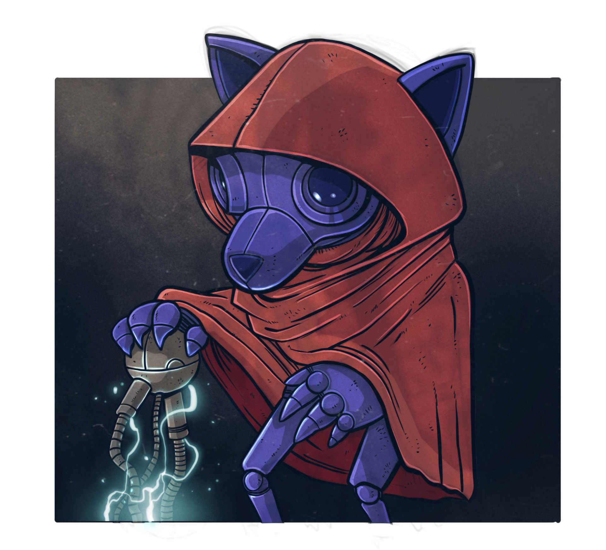

@chapter #ch-writing .dg-guide ch="1"

@page .dg-doc

Chapter 1 {.dg-kicker}

# Writing a Page

A Dimm City book is plain markdown with a small vocabulary of `@` markers. Markdown carries the text; markers draw the structure — chapters, pages, sections, and the components the rest of this guide catalogs. This chapter is the grammar. {.dg-lede}

## The structure markers

Gutterpress itself provides the structural markers. They wrap everything that follows until the matching `@end-` marker, the next marker of the same kind, or the end of the file.

| Marker | Closes with | What it is |
|---|---|---|
| `@chapter #id ch="N"` | next `@chapter` / end of file | A chapter. `ch="N"` prints the `c.N` footer on every page of it |
| `@page .class` | next `@page` | A page. Classes pick a page template ([Page Templates](#ch-templates)) |
| `@spread` | next `@spread` / `@page` | Two facing pages kept together |
| `@section .class` | `@end-section` | A region on the page: columns, a panel, a named component chassis |
| `@page-break` | — | Force a new page here |
| `@column-break` | — | Force the next column, inside a multi-column `@section` |

A chapter is one file. A `@chapter` line opens each file, and the chapter ends where the file ends.

```markdown
@chapter #ch-augmerc ch="3"

@section

## The Augmerc

Muscle for hire. The difference is gear, grafts, and how much of them is still original.

@end-section
```

Result {.dg-result}

<div class="dg-stage">

@section

## The Augmerc

Muscle for hire. The difference is gear, grafts, and how much of them is still original.

@end-section

</div>

A bare `@section` is a styled panel — the section chassis with its accent rule and substrate. Add `.dc-plain` to get an unstyled grouping, or one of the classes in [Layout](#ch-layout) for columns and named chassis. The named chassis also have a marker of their own: `@npc-stat` is the same section as `@section .dc-npc-stat`, and likewise `@column-panel`, `@tabbed`, `@card-grid`, `@citizen-walkthrough`, `@fiction-excerpt`, `@flaws`, `@ideals` and `@dreams`. Either spelling renders the same.

## Attributes

Every marker takes the same attribute grammar after its name, in any order: `#id` sets an id, `.class` adds a class, `key=value` or `key="quoted value"` sets a named option.

```markdown
@column-panel #core-loop .gp-columns-2

@callout variant=warning label="Heat is shared"
```

Standard markdown elements take attributes too, with braces at the end of the element: `## Title {.dc-spray}`, `{.dc-img-float-right}`, and `@skill {.dc-allow-split}` for a class on a component macro.

## The blank-line rule

Markers are paragraphs to markdown. A marker directly under a list item or paragraph line becomes part of that paragraph and is never seen. Put a blank line before and after every marker.

```markdown
@procedure

1. Pick a Spec.
2. Spend 6 Spec Points.

@end-procedure
```

Result {.dg-result}

<div class="dg-stage">

@procedure

1. Pick a Spec.
2. Spend 6 Spec Points.

@end-procedure

</div>

Without the blank line before `@end-procedure`, the closer is swallowed by the last list item and the procedure stays open to the end of the page.

## Markdown the system styles

Nothing below needs a class or a marker. The package styles the standard elements the way a Dimm City page expects.

### Headings

```markdown
# Chapter title
## Section heading
### Sub-section
#### Item heading
```

`#` opens a chapter or a specialty. `##` is a section with an accent rule. `###` labels a column or a sub-topic. `####` is an item: a skill, a gear entry, a stat-block name. In a two-column layout, `###` and `####` are the workhorses — `#` and `##` are too wide for a 3.5-inch column.

### Emphasis and inline code

```markdown
**Bold** lands in burnt orange.
*Italic* shifts to warm smoke.
`SysChk` marks a keyword that is also a mechanic.
```

<div class="dg-stage dg-on-paper">

**Bold** lands in burnt orange. *Italic* shifts to warm smoke. `SysChk` marks a keyword that is also a mechanic.

</div>

### Lists

```markdown
- A loose list
- of short items

1. An ordered list
2. for sequences
```

<div class="dg-stage dg-on-paper">

- A loose list
- of short items

1. An ordered list
2. for sequences

</div>

### Tables

Pipe tables get the header band, alternating fills, and the data type size. Roll tables, option tables, and stat references are all plain tables.

```markdown
| Band | Range |
|---|---|
| **Reach** | Adjacent |
| **Near** | Same room |
```

<div class="dg-stage">

| Band | Range |
|---|---|
| **Reach** | Adjacent |
| **Near** | Same room |

</div>

### Blockquote

A plain `>` quote is an epigraph: accent rail, italic body. Inside a skill card the first `>` line is the card's flavor.

```markdown
> Every city has a language.
>
> — Hollis Vance
```

<div class="dg-stage">

> Every city has a language.
>
> — Hollis Vance

</div>

### Definition list

A term line and a `: definition` line render as the on-brand glossary form.

```markdown
Tick
: A heartbeat. Used in ability text to mean *immediately*.

Reach
: Close enough to touch.
```

<div class="dg-stage">

Tick
: A heartbeat. Used in ability text to mean *immediately*.

Reach
: Close enough to touch.

</div>

### Smart typography and footnotes

`--` becomes an en dash, `---` an em dash, `...` an ellipsis, and straight quotes curl. Footnotes use `[^label]` inline and `[^label]: text` anywhere in the file; they render at the end of the content flow.

### Images

An image on its own line is a figure. Place it in the flow where it should sit; floats and framing are classes, described in [Layout](#ch-layout).

```markdown

```

## A complete page

Putting the pieces together — the shape of an ordinary body page in a Dimm City book:

```markdown
@chapter #ch-rules ch="4"

@column-panel .gp-columns-2

## Augment Points

**AP** is your push. If an ability lists an AP cost, you spend it and the effect happens.

@column-break

- **0 AP** — Free to use. Not always safe.
- **1–X AP** — You choose how hard you push.

@end-column-panel

> [!NOTE]
> You start every dream with 10 AP.
```

Result {.dg-result}

<div class="dg-stage">

@column-panel .gp-columns-2

## Augment Points

**AP** is your push. If an ability lists an AP cost, you spend it and the effect happens.

@column-break

- **0 AP** — Free to use. Not always safe.
- **1–X AP** — You choose how hard you push.

@end-column-panel

> [!NOTE]
> You start every dream with 10 AP.

</div>
